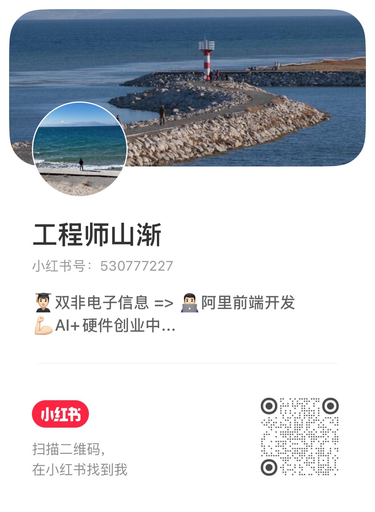
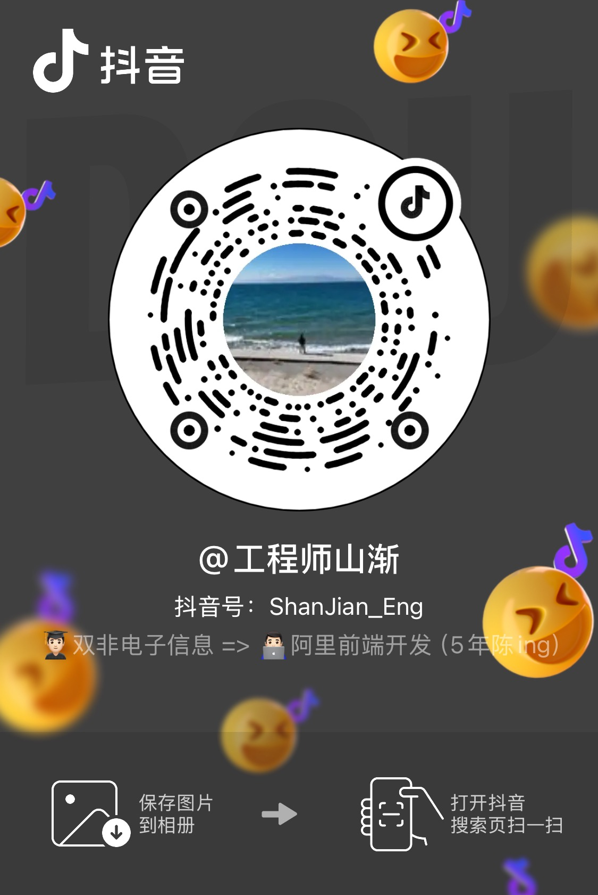

# Wesley · 工程师山渐

前端工程师、内容创作者，也在持续做独立产品实验。

项目会变，工具也会变。我长期关注的是：**技术与组织不断变化时，普通人怎样把事情做成，并为自己增加能力、收入与选择。**

这里记录我亲自做过的工程实践、AI 产品实验和公开思考。我希望把复杂问题讲清楚，也把判断变成能运行、能验证、能复用的东西。

---

## 我在研究和分享什么

**AI 与普通人**

不追逐每一个新工具，而是讨论 AI 真正改变了谁的工作、机会和利益，以及普通人该怎样使用它，而不是被它制造的焦虑推着走。

**职场与成长**

从工程师、mentor 和招聘观察出发，聊新人培养、信任积累、协作冲突、简历面试与抗压能力。重点不是职场话术，而是怎样在真实组织里把事情做成。

**产品与副业实验**

从真实需求出发，做产品定义、交互设计、开发、测试和发布。我关心的不只是「AI 能不能把 App 写出来」，更关心它有没有人需要、能不能稳定交付、是否可能形成收入。

**思考与行动方法**

把工程思维、实践经验和更广泛的社会观察放在一起，讨论人在不确定环境里如何识别主要问题、减少空转，并通过行动形成自己的判断。

---

## 我正在做的实践

### [Spark Skills](https://github.com/China-Wesley/spark-skills)

把产品研究、设计与创作方法整理成 Agent 可以直接执行、验证和复用的工作流。这是我近期的公开实践之一。

### 独立产品实验

持续寻找适合个人开发者验证的窄需求，从需求调研、原型设计一路做到可运行产品。比起快速生成 Demo，我更在意真实使用、测试反馈与长期迭代。

### 内容创作

用工程师的一线经历讲 AI、产品、职场与个人成长。通常从一个反常识判断开始，拆开背后的技术、组织或商业机制，最后给出普通人可以执行的方法。

---

## 我相信的几件事

- **先确认问题，再选择工具。** 工具更新很快，真正值得积累的是识别问题和完成交付的能力。
- **会生成，不等于会负责。** 能跑的代码、好看的 Demo 和真实可用的产品之间，还有验证、测试与反馈。
- **信任来自一次次可靠交付。** 无论工作、产品还是内容，长期价值都不是靠包装出来的。
- **实践会修正判断。** 与其等待一套永远正确的方法，不如先做、获得反馈，再不断调整。

---

## 在其他平台找到我

我会在小红书和抖音分享 AI、独立开发、职场实践与个人思考。点击图片可以查看原图并扫码。

### 小红书 · 工程师山渐

小红书号：`530777227`

  

### 抖音 · 工程师山渐

抖音号：`ShanJian_Eng`

  

如果你也在研究 AI 产品、独立开发，或者关心技术变化之下普通人的选择，欢迎从项目、Issue 或内容区开始交流。
